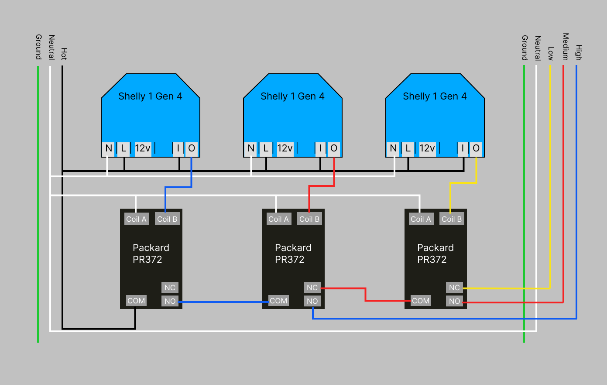
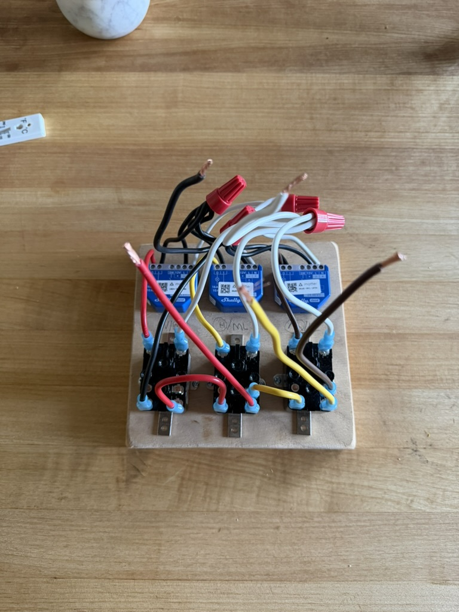
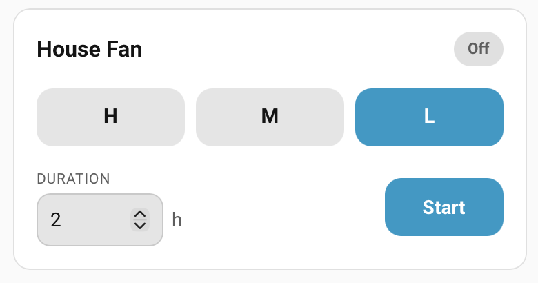
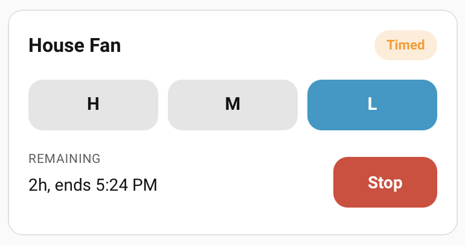
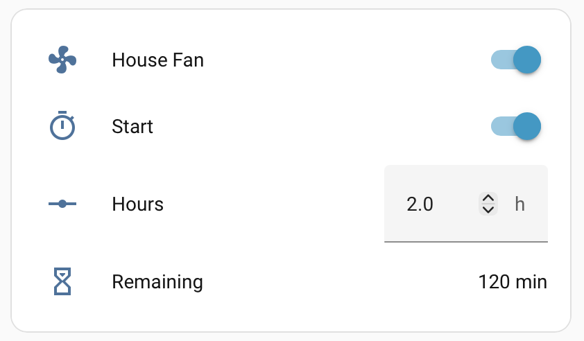

# QuietCool Whole House Fan Controller for Home Assistant using Shelly 1 Gen 4 and Packard PR372 Fan Relay

A Home Assistant custom integration for controlling a multi-speed whole-house fan.

Typical hardware:

- QuietCool multi-speed whole-house fan.
- Shelly 1 Gen 4 relays exposed to Home Assistant as switch entities.
- PACKARD PR372 Fan Relay for speed selection.
- One relay/switch for master fan power.
- Two relay/switches for speed selection.
- Hardware relay wiring so only the intended speed lead can be energized.

The integration exposes a clean Home Assistant UI through these entities:

- `fan.house_fan` — main fan control with `Low`, `Medium`, and `High` preset modes.
- `number.house_fan_run_hours` — timer duration in hours.
- `switch.house_fan_timed_run` — start/stop toggle for a timed run.
- `button.house_fan_start_timer` — one-shot button to start a timed run.
- `sensor.house_fan_timer_remaining` — remaining timer minutes.
- `sensor.house_fan_timer_finishes_at` — timer finish timestamp.

## Wiring warning

This integration is written for a Shelly 1 Gen 4 relay setup driving a PACKARD PR372 Fan Relay. Use correct wiring, proper enclosures, and rated relays/contactors so only the intended speed lead can be energized.





## Installation with HACS

This repository is intended to be installed as a HACS custom repository.

1. Open Home Assistant.
2. Open HACS.
3. Go to the three-dot menu in the top right.
4. Choose **Custom repositories**.
5. Add this repository URL:

   ```text
   https://github.com/ccorcos/quietcool-shelly-homeassistant
   ```

6. Category: **Integration**.
7. Click **Add**.
8. Search HACS for **QuietCool Shelly House Fan Controller**.
9. Install it.
10. Restart Home Assistant.

## Add the integration

1. Go to **Settings → Devices & services**.
2. Click **Add integration**.
3. Search for **QuietCool Shelly House Fan Controller**.
4. Select your three switch entities:
   - Master power switch.
   - Speed relay A.
   - Speed relay B.
5. Configure the relay truth table for Low, Medium, and High.
6. Save.

## Compact dashboard card




This integration includes a compact Lovelace card with speed selection, duration/remaining display, and Start/Stop control.

The card appears in the Home Assistant card picker as **QuietCool House Fan**. Its YAML card type is `custom:quietcool-house-fan-card`.

First add the card as a dashboard resource:

1. Go to **Settings → Dashboards**.
2. Open the three-dot menu in the top right.
3. Choose **Resources**.
4. Click **Add resource**.
5. URL:

   ```text
   /whole_house_fan_controller/quietcool-house-fan-card.js
   ```

6. Resource type: **JavaScript module**.
7. Click **Create**.
8. Refresh your browser.

Then add the card to a dashboard:

1. Open the dashboard you want to edit.
2. Click **Edit dashboard**.
3. Click **Add card**.
4. Search for **QuietCool House Fan**, or choose **Manual** and paste this YAML:

```yaml
type: custom:quietcool-house-fan-card
entity: fan.house_fan
duration_entity: number.house_fan_run_hours
timed_run_entity: switch.house_fan_timed_run
remaining_entity: sensor.house_fan_timer_remaining
finishes_at_entity: sensor.house_fan_timer_finishes_at
name: House Fan
```

The `name` field controls the card title. If omitted, the card uses the fan entity's friendly name.

When the fan is off, the card shows duration controls with a direct hour input, +/- step buttons, and **Start**. When a timed run is active, it shows remaining time and **Stop**. If the fan is on without a timer, remaining shows **∞** and **Stop** turns the fan off.


## Built-in dashboard card example



Home Assistant will create the fan, timer number, timer button, timed-run switch, and timer sensors after you add the integration. To put them together using only built-in cards:

1. Open the dashboard you want to edit.
2. Click **Edit dashboard**.
3. Click **Add card**.
4. Scroll to the bottom and choose **Manual**.
5. Paste the YAML below.
6. Click **Save**.

If your entity IDs are different, replace the entity IDs in the YAML with the ones Home Assistant created for your setup.

```yaml
type: entities
entities:
  - entity: fan.house_fan
    name: House Fan
  - entity: switch.house_fan_timed_run
    name: Start
  - entity: number.house_fan_run_hours
    name: Hours
  - entity: sensor.house_fan_timer_remaining
    name: Remaining
```

